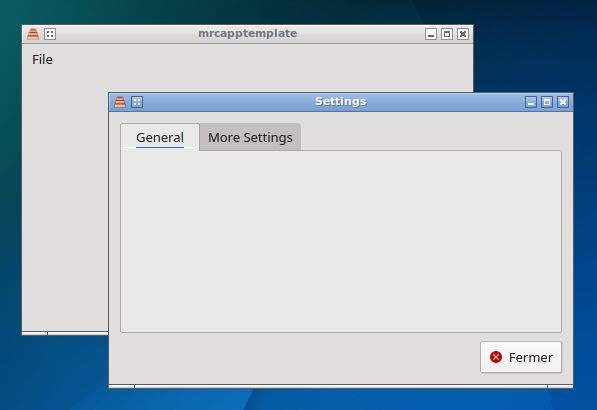

# {{ cookiecutter.project_name }}

One-line summary of your application.

Long description of your application.

## Building it

This application requires Qt 5 and CMake. To build it, do the following:

Get the source:

    git clone https://example.com/{{ cookiecutter.project_slug }}
    cd {{ cookiecutter.project_slug }}
    git submodule update --init

Build it:

    mkdir build
    cd build
    cmake ..
    make
    sudo make install

You can also build rpm and deb files using `make package` after `make`.
